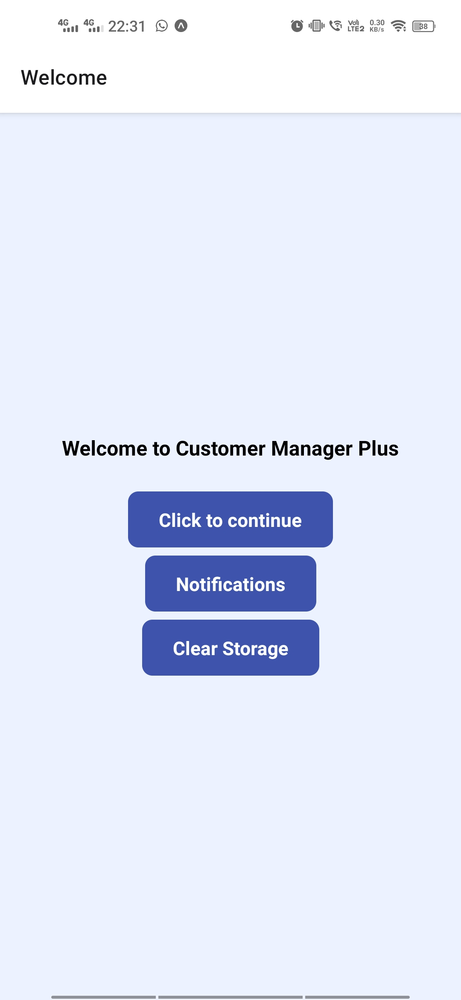

# Customer-Relationship-Management-Udacity
This is a react project and it is part of Udacity Frontend Nanodegree course. This is a react native project to create a CRM app so that sale representative can more easily add and update customer contact information

## Installation
1. git clone repository in cmd:
    ```
    git clone https://github.com/prosenjeetshil/Customer-Relationship-Management-Udacity.git
    ```
2. install dependencies
    ```
    cd Customer-Relationship-Management-Udacity
    npm install
    yarn install
    ```
3. start server
    ```
    npm start
    ```
    web: press `w` to launch web view
    mobile: download the expo go app and scan the QR code

## Screenshot
  
  
  
  
  